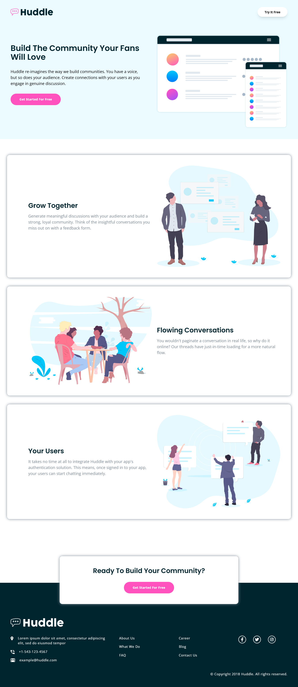

# Frontend Mentor - Huddle landing page with alternating feature blocks solution

This is a solution to the [Huddle landing page with alternating feature blocks challenge on Frontend Mentor](https://www.frontendmentor.io/challenges/huddle-landing-page-with-alternating-feature-blocks-5ca5f5981e82137ec91a5100). 

## Built with

- Semantic HTML
- CSS
- Tailwind CSS
- Flexbox
- Mobile-first workflow

## Links

- [Code](https://github.com/himanshuat/frontend-mentor/tree/main/huddle-landing-page-with-alternating-blocks)
- [Live](https://himanshuat.github.io/frontend-mentor/huddle-landing-page-with-alternating-blocks)

## Screenshot

